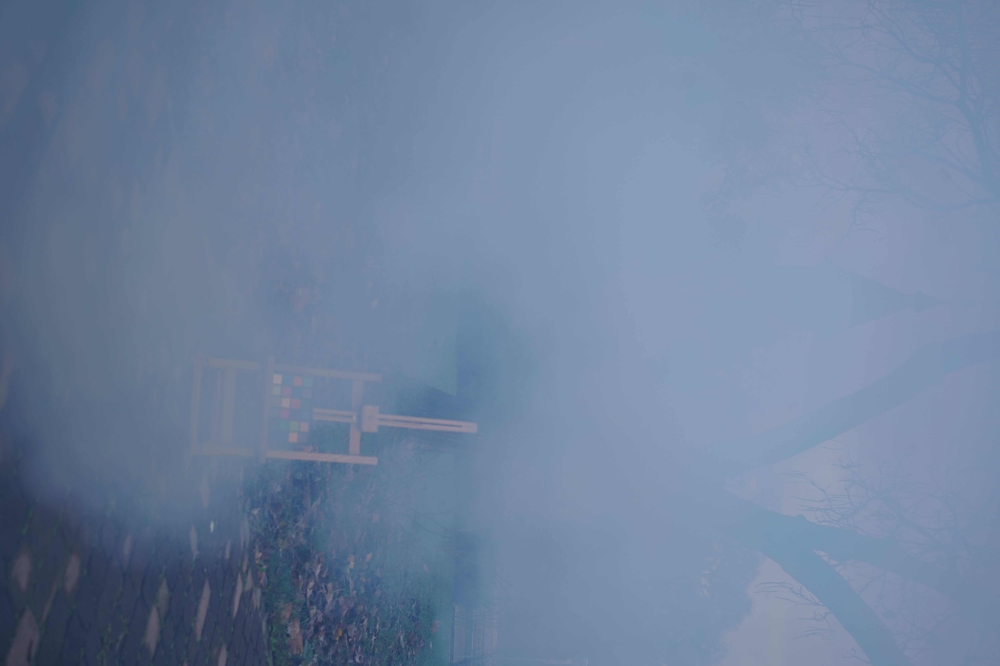
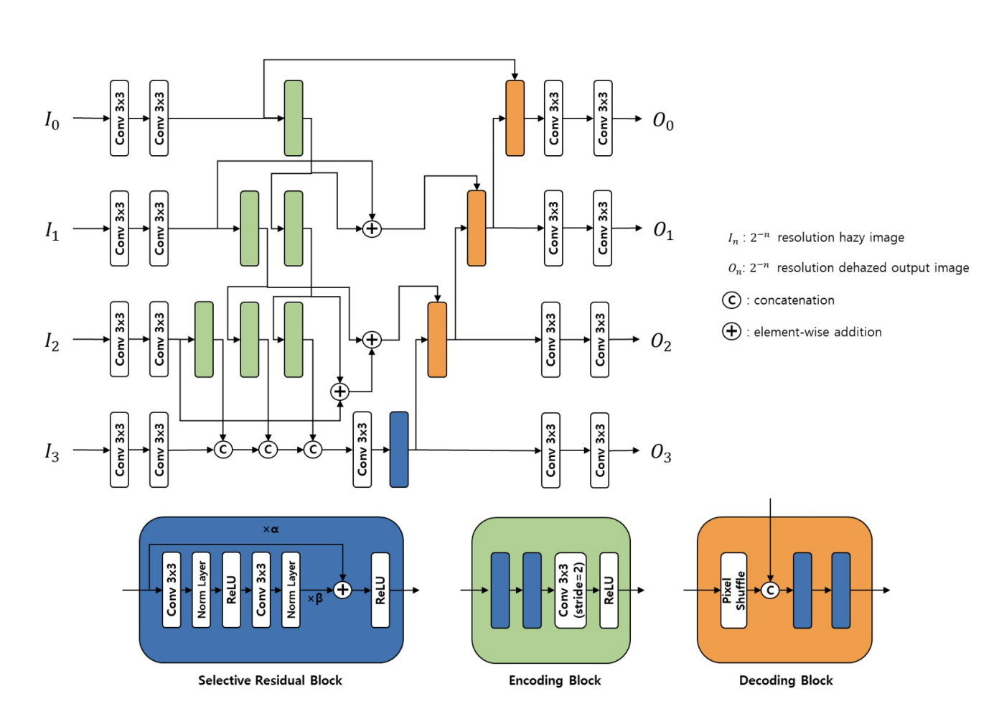

# IVP-Project

## Project Title

**NTire Dense and Non-Homogeneous Dehazing Challenge**

## Team Members

Kandukuri Lohith Saradhi

Achintya Lakshmanan

## Expected Outcome

Perceptually viable de-hazed images preferably requiring lower computation

## Details of the dataset to be used

Paired images of Hazed and De-hazed images as shown below

    
    

- Only 40 such image pairs are available
- Can use other datasets such as [IHAZE](https://data.vision.ee.ethz.ch/cvl/ntire18//i-haze/), [OHAZE](https://data.vision.ee.ethz.ch/cvl/ntire18//o-haze/), [DHAZE](https://data.vision.ee.ethz.ch/cvl/ntire19/dense-haze/) (score deduction is applied when using other data)

## Work done so far

### Research Done

- Went through [NTIRE 2023 HR Dehazing Challenge Report](https://openaccess.thecvf.com/content/CVPR2023W/NTIRE/papers/Ancuti_NTIRE_2023_HR_NonHomogeneous_Dehazing_Challenge_Report_CVPRW_2023_paper.pdf)

<table>
    <tr>
        <th>Research Article</th>
        <th>Dataset and Variables used</th>
        <th>Download data URL</th>
        <th>Solution Approach</th>
        <th>Interesting Insights</th>
    </tr>
    <tr>
        <td><a href="https://openaccess.thecvf.com/content/CVPR2023W/NTIRE/papers/Zhou_Breaking_Through_the_Haze_An_Advanced_Non-Homogeneous_Dehazing_Method_Based_CVPRW_2023_paper.pdf">DWT-FFC</a></td>
        <td></td>
        <td></td>
        <td>DWT-FFC + ConvNeXt prior knowledge network</td>
        <td>FFCs are epic, they allow models to learn global and local features separately and use them varyingly with depth in networks</td>
    </tr>
    <tr>
        <td><a href="https://openaccess.thecvf.com/content/CVPR2023W/NTIRE/papers/Liu_A_Data-Centric_Solution_to_NonHomogeneous_Dehazing_via_Vision_Transformer_CVPRW_2023_paper.pdf">ITB_Dehaze</a></td>
        <td></td>
        <td></td>
        <td></td>
        <td>Converts all the images to the distribution of current year dataset.</td>
    </tr>
    <tr>
        <td><a href="https://openaccess.thecvf.com/content/CVPR2021W/NTIRE/papers/Jo_Multi-Scale_Selective_Residual_Learning_for_Non-Homogeneous_Dehazing_CVPRW_2021_paper.pdf">[Mask]]</a></td>
        <td></td>
        <td></td>
        <td></td>
        <td>Simple multi scale Resnet type arch</td>
    </tr>
</table>

### Work Done

- Built the network in pytorch.
- Loaded, augmented and tested the forward and backward prop pipeline.

### To Do

- Train the model - already requested for HPC access.
- Incorporate ITB Dehaze preprocessing
- Modify [Mask] to exploit FFC.

## Approach

- Train a [Mask] network with augmented data from other datasets
    
    
    
    - Possible change in architecture : Incorporate FFCs along with conventional Convolutions to allow the model to learn global and local features as different feature maps.
- Incorporate the preprocessing implemented in ITB De-haze Paper.
- Since SSIM loss is agnostic to local fluctuations, we propose a LocalSSIM loss.
- **LocalSSIM Loss :**
    - Split the image into chunks of size NxN. (some chunks will have a different size)
    - Compute SSIM loss for each chunk and take the average.

###